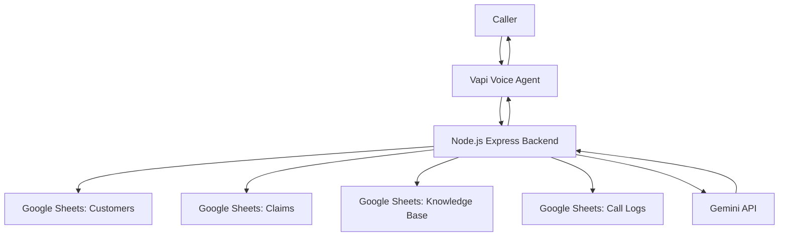

# VoiceAI Claims Support Agent

A production-style Voice AI assistant for insurance claim support, built for the Observe.AI AI Agent Engineer take-home assessment.

The agent can authenticate callers, retrieve claim status, answer claims-related FAQs using Gemini-powered RAG, escalate to a human representative, and log post-call interaction records.


---

## Live Demo

**Backend:** https://voiceai-claims-support-agent.onrender.com  
**Health Check:** https://voiceai-claims-support-agent.onrender.com/health  
**Voice Platform:** Vapi

---

## Demo

The assistant supports an end-to-end claim status flow:

```text
Caller asks for claim status
→ Agent collects phone number
→ Customer lookup
→ DOB verification
→ Claim status retrieval
→ FAQ handling if needed
→ Post-call logging
```


---

## Features

- Voice-based inbound claims support
- Customer lookup using phone number
- Identity verification using DOB
- Claim status retrieval from an external system
- Gemini-powered RAG for general claims FAQs
- Human representative escalation
- Post-call logging to Google Sheets
- Deployed backend with structured API tools

---

## Architecture



---

## Tech Stack

| Area | Stack |
|---|---|
| Voice Agent | Vapi |
| Backend | Node.js, Express.js |
| Validation | Zod |
| Database / External System | Google Sheets |
| RAG / LLM | Gemini API |
| Deployment | Render |

---

## Vapi Tools

| Tool | Purpose |
|---|---|
| `lookup_customer` | Finds customer by phone number |
| `verify_customer` | Verifies caller identity using phone + DOB |
| `get_claim_status` | Retrieves claim details after authentication |
| `knowledge_search` | Answers general FAQs using Gemini RAG |
| `escalate` | Creates a human representative escalation |
| `log_call` | Saves post-call interaction summary |

<!-- Add screenshot here after saving it as docs/screenshots/vapi-tools.png -->
<!--  -->


---

## Main API Endpoints

### `GET /health`

Checks backend, Google Sheets, and LLM configuration.

### `POST /lookup-customer`

```json
{
  "phone": "9876543210"
}
```

### `POST /verify-customer`

```json
{
  "phone": "9876543210",
  "dob": "1994-05-12"
}
```

### `POST /get-claim-status`

```json
{
  "customer_id": "CUST001"
}
```

### `POST /knowledge-search`

```json
{
  "query": "How do I submit missing documents?"
}
```

### `POST /escalate`

```json
{
  "customer_id": "CUST001",
  "phone": "9876543210",
  "reason": "Caller requested a human representative."
}
```

### `POST /log-call`

```json
{
  "caller_name": "Rahul Sharma",
  "phone": "9876543210",
  "customer_id": "CUST001",
  "claim_id": "CLM1001",
  "call_summary": "Customer checked the status of an approved claim.",
  "sentiment": "neutral",
  "outcome": "claim_status_shared",
  "escalated": false
}
```

---

## External System

Google Sheets is used as a lightweight external system with four tabs:

| Sheet | Purpose |
|---|---|
| `customers` | Customer profile and verification data |
| `claims` | Claim status, documents, and next steps |
| `knowledge_base` | FAQ content for RAG |
| `call_logs` | Post-call interaction records |

<!-- Add screenshot here after saving it as docs/screenshots/google-sheets-data-model.png -->
<!--  -->


---

## Demo Test Data

### Happy Path

```text
Phone: 9876543210
DOB: 1994-05-12
```

Expected result: customer is verified, approved claim status is shared, and call is logged.

### Documents Required

```text
Phone: 9876543211
DOB: 1991-11-20
```

Expected result: customer is verified, required documents are explained, and call is logged.

### Authentication Failure

```text
Phone: 9876543210
DOB: 1990-01-01
```

Expected result: claim details are not shared and representative support is offered.

### FAQ

```text
What are your office hours?
```

Expected result: answer is generated using Gemini RAG from the knowledge base.

---

## Security and Reliability

- Claim details are never shared before identity verification.
- Customer lookup and claim retrieval are separated.
- LLM is not used to generate claim-specific data.
- Claim status always comes from structured records.
- Environment variables and credentials are not committed.
- Post-call logging creates an audit trail.

---

## Local Setup

```bash
git clone https://github.com/N-Aryan/voiceai-claims-support-agent.git
cd voiceai-claims-support-agent
npm install
npm run dev
```

Create a `.env` file:

```env
PORT=3000
GOOGLE_SHEET_ID=
GOOGLE_SERVICE_ACCOUNT_EMAIL=
GOOGLE_PRIVATE_KEY=
GEMINI_API_KEY=
GEMINI_EMBEDDING_MODEL=gemini-embedding-2
GEMINI_GENERATION_MODEL=gemini-2.5-flash
NODE_ENV=development
```

Run API tests:

```bash
npm run test:api
```

---

## Deployment

The backend is deployed on Render.

```text
Build Command: npm install
Start Command: node src/server.js
```

Required environment variables:

```text
GOOGLE_SHEET_ID
GOOGLE_SERVICE_ACCOUNT_EMAIL
GOOGLE_PRIVATE_KEY
GEMINI_API_KEY
GEMINI_EMBEDDING_MODEL
GEMINI_GENERATION_MODEL
NODE_ENV
```

<!-- Add screenshot here after saving it as docs/screenshots/render-health-check.png -->
<!--  -->

---

## Assignment Coverage

| Requirement | Status |
|---|---|
| VoiceAI agent | Complete |
| Customer lookup integration | Complete |
| Claim retrieval integration | Complete |
| Post-call writeback | Complete |
| Authentication failure flow | Complete |
| Customer not found flow | Complete |
| Escalation flow | Complete |
| FAQ / knowledge base | Complete |
| Deployed backend | Complete |

---

## Author

Aryan Narang  
GitHub: [N-Aryan](https://github.com/N-Aryan)
